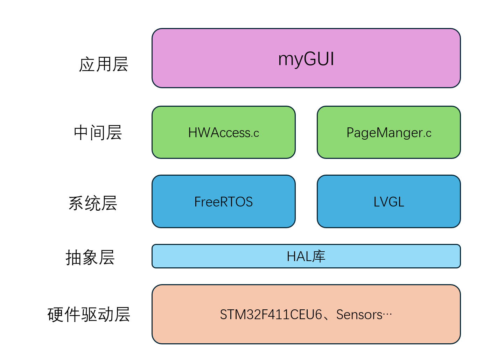
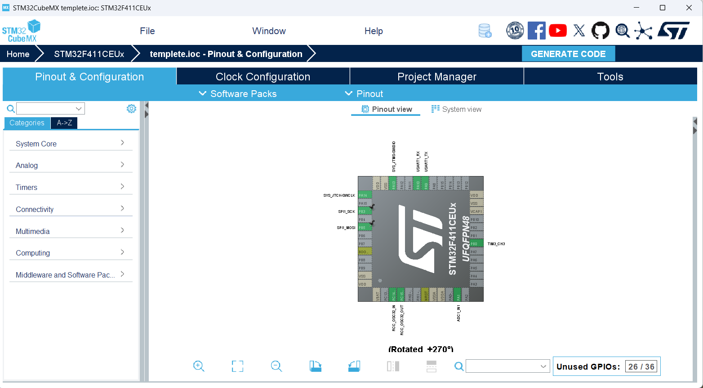
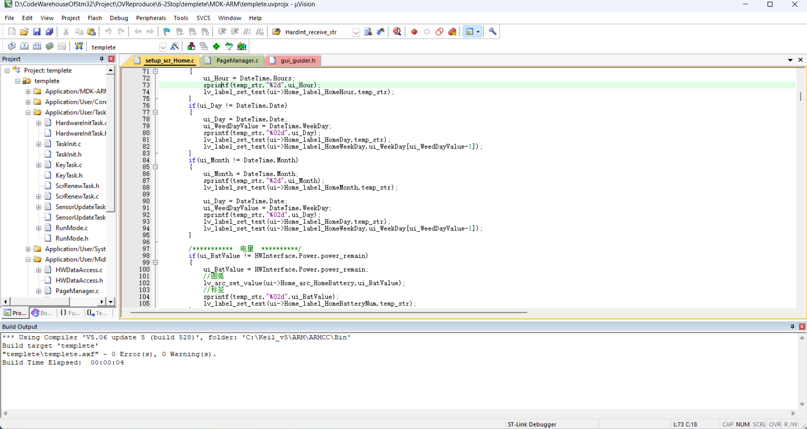
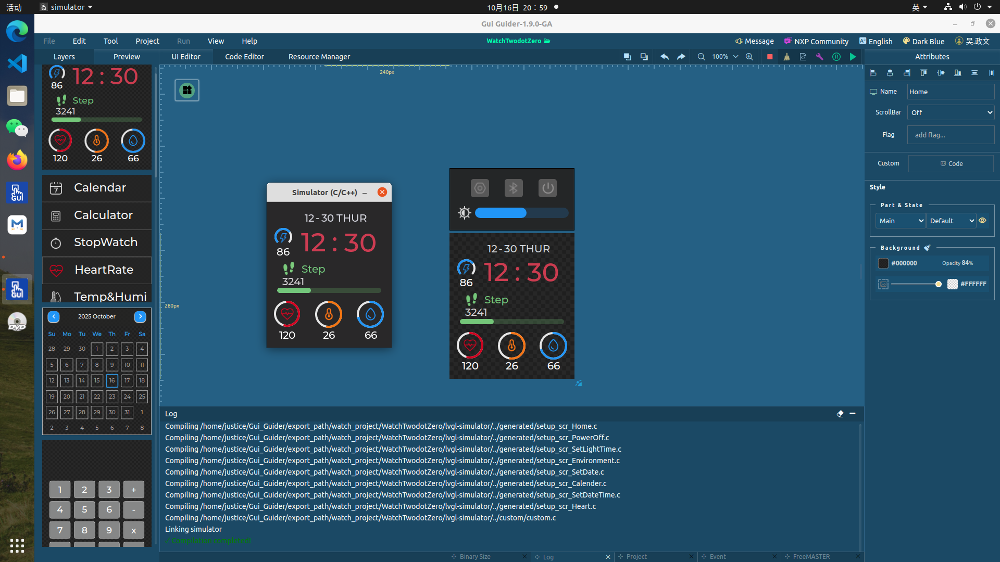

# 基于FreeRTOS和LVGL的智能手表

## 项目概述

一个基于`STM32F411CUE6`微控制器、`FreeRTOS`实时操作系统和`LVGL`图形库开发的多功能智能手表原型。本项目独立实现了从`底层传感器驱动`（I2C/SPI）到`系统构建`（FreeRTOS）再到`上层应用`（LVGL）的**全流程开发**，完整复刻了智能手表的心率、海拔、温湿度等`数据测量`和熄屏、休眠的`低功耗设计`等核心功能。重点解决有限MCU内存下，UI界面无卡顿的挑战，实现了`30FPS+`流畅运行。

---

## 功能展示

### 低功耗设计

若检测用户15秒内无操作，则从运行模式进入熄屏模式；
    
若熄屏模式下设定时间内用户无操作，则停止喂狗、进入休眠模式；

按下按键等外部中断唤醒MCU，重新进入运行模式。

### UI界面切换

使用SPI+DMA模式驱动触摸屏，减轻MCU开销，同时采用双缓冲异步渲染方式，加快UI界面渲染。

UI界面间的切换使用一个界面栈进行管理--加载新界面则入栈，按键按下则出栈，返回上一界面。

### Home界面

### 心率测量界面

### 秒表界面

### 指南针界面

### 温湿度测量界面

### 设置界面

---

## 软件架构

---

## 开发工具

### STM32开发：使用CubeMX + Keil 联合开发。

---

### GUI开发：使用GUI Guider生成LVGL代码后，移植到STM32进行开发。

---

## 实现的技术细节

### 传感器数据流

#### 数据生产

生产对象包括：心率传感器EM7028、温湿度传感器AHT21、电子罗盘 LSM303、气压计SPL06_001以及MPU6050。

如此多类的传感器，要是每个传感器都占用几个GPIO口，则会造成硬件资源的极度浪费。因此，有必要引入I2C总线，用总线来仲裁传感器的收发消息。本项目采取软件I2C的方式进行通信，为此编写了I2C驱动代码 [MyI2C](./BSP/MyI2C.c)。

#### 数据传输

本项目中，每一个生产对象都有着多样的消费去处，再加上如此多的生产对象，更是会大大加剧这一数据流的复杂程度。因此为了减小调试时的代码量和降低各个文件之间的耦合程度，有必要增加一个中间层Hardware Data Access来管理数据之间的传输流动。

`使用面向对象的编程思维思考`

`定义一个结构体`，用来管理所有传感器获得的数据。详细定义转到[HWDataAccess.h](./User/MiddleLayer/HWDataAccess.h).

    typedef struct
    {
        HW_RTC_InterfaceTypeDef RealTimeClock;
        HW_Power_InterfaceTypeDef Power;
        HW_LCD_InterfaceTypeDef LCD;
        HW_AHT21_InterfaceTypeDef AHT21;
        HW_Barometer_InterfaceTypeDef Barometer;
        HW_Ecompass_InterfaceTypeDef Ecompass;
        HW_HRmeter_InterfaceTypeDef HR_meter;
        HW_IMU_InterfaceTypeDef IMU;
    } HW_InterfaceTypeDef;

`实例化这个结构体`，将其作为一个全局对象HWInterface，对象的成员函数使用具体的BSP驱动函数进行填充。具体操作转到[HWDataAccess.c](./User/MiddleLayer/HWDataAccess.c).

    HW_InterfaceTypeDef HWInterface = {
        .RealTimeClock = {
            .GetTimeDate = HW_RTC_Get_TimeDate,
            .SetDate = HW_RTC_Set_Date,
            .SetTime = HW_RTC_Set_Time,
            .CalculateWeekday = HW_weekday_calculate
        }
    };

这样一来，如果某处需要消费传感器数据，则只需要包含HWDataAccess.h，调用全局对象HWInterface的成员函数即可。

#### 数据消费

`数据的消费去处集中在MyGUI应用层中`

某某测量的UI界面和Home界面中，会随着屏幕对象的创建，对应的创建一个LVGL定时器，该定时器的回调函数负责定时更新UI控件的相关数据。

定时器的回调函数并不会负责更新传感器的数据，而是简单的**调用HWInterface这个全局对象的成员函数**，获取数值，更新控件。

#### 数据更新

注意到，传感器数据流的流动并非是一次性的。当用户停留在某个界面时，必须要在屏幕上显示实时的更新的数据。而数据消费的消费者是不会负责更新数据的。

因此必须创建一个线程，判断当前的UI界面，主动将数据更新到HWInterface这个全局对象中（数据的更新也要遵循数据传输的规则流动）。

代码实现[SensorUpateTask](./User/Tasks/SensorUpdateTask.c).

---

### UI界面管理

#### 界面栈

如前面所提到的，UI界面之间的切换使用一个界面栈进行管理--加载则入栈，按键按下则回退界面并出栈。

`再次使用面对对象的编程思维来思考`

`定义一个结构体`，将每个屏幕作为加载和回退操作的对象。

    typedef struct{
        const char * name;
        void (*init)(lv_ui *ui);
        void (*deinit)(void);
        lv_obj_t **page_obj;
    }Page_t;

`实例化`，在每个屏幕的.c文件中，实例化一个屏幕对象，并且将具体的函数填充进这个对象的成员函数中。

`定义一个数据结构`,屏幕的加载回退具有一种“后进先出”的特点，这正是栈这一数据结构的特点。因此选择开辟一个页面栈，具体实现见[PageManger.h](./User/MiddleLayer/PageManager.h).

`栈的基本操作`,完成前面的步骤之后，屏幕的加载回退就变成了一个简单的入栈、出栈操作了。填入对应的LVGL加载屏幕的API函数，便实现了页面栈这一界面管理器。

代码实现[PageManger.c](./User/MiddleLayer/PageManager.c)

#### 界面的加载回退

这里主要讨论一种`人机交互`的逻辑.

`加载操作的使用`--主要用在用户点击某个控件，想要进入某个具体的应用这一场景下。因此，只需要保证界面栈的栈底永远存在Home界面，栈内其他元素如何进栈，进栈的顺序如何都无关紧要了。

`回退操作的使用`--主要用在应用使用完毕，或是出现异常需要返回。由此，回退是一种更为紧要的事情，不能单纯的靠软件实现。

由此，我们有必要新建一个线程，获取Key的键值，利用Key这一中断实现有效的回退。

同时需要考虑，Key的键值并非单纯用于加载回退这一任务。为了降低文件之间的耦合性，将Key的键值获取线程和加载回退的线程分开实现。

代码实现[KeyValue](./User/Tasks/KeyTask.c)、[Load&Back](./User/Tasks/ScrRenewTask.c).

---

### FreeRTOS系统构建

RTOS中一个线程的优先级是十分重要的，其不仅决定了线程调度的时间，更是事关整个系统是否能正常运行。由此，对系统各个线程的重要程度进行分析是必要的。以下均是个人理解，由线程的功能分类来选择优先级。

`初始化线程`，用于初始化其他线程或是初始化硬件。一个特点就是运行结束后自删。这类线程通常是系统启动时，第一批被调度上MCU的，有了它们的构建，后面的线程才能有发挥的控件。由此，这类线程的优先级应当最高的一批。如[TaskInit](./User/Tasks/TaskInit.c)、[HardwareInit](./User/Tasks/HardwareInitTask.c).

`系统级线程`,用于改变系统的状态。具体来说就是它们上处理机之后，系统的运行状态会改变。典型的就是看门狗线程，如果系统启动后不能定时喂狗，被其他线程阻塞，那就会导致整个系统都崩溃。由此，这类线程应当在初始化后第一批执行，并且不能被其他线程阻塞。如[WDog](./User/Tasks/TaskInit.c)、[Stop](./User/Tasks/ScrRenewTask.c).

`实时性线程`,用于改变应用的状态，但是不影响系统运行。比如及时获取按键值是很需要高实时性的[KeyValue](./User/Tasks/KeyTask.c)；还有令系统熄屏，也是要高于应用优先改变的[IdleEnter](./User/Tasks/RunMode.c).

`应用级线程`,用于加载应用程序及其相关事项。应用运行前，保证其相关的数据更新到位，遵循这一原则就能很快排好序了。典型的如[LVGL_Handler](./User/Tasks/TaskInit.c)和[SensorUpdate](./User/Tasks/SensorUpdateTask.c).

---

### 低功耗设计

#### 运行状态
包括`运行`、`熄屏`和`休眠`,后续会加上`关机`状态.

#### 切换逻辑

运行：使用RTOS的软件定时器，不断自增Idle以记录空闲时间，当存在LVGL活动或其他应用活动时，通过传递IdleBreak信号量，将Idle重置为0。若未能及时传递IdleBreak信号，则进入IdleEnter线程，熄屏。

熄屏：若设定时间内，仍然为传递IdleBreak信号，则发送stop信号至Stop线程，停止喂狗、失能传感器以及相关操作，使MCU进入休眠状态。

休眠：可以通过外部看门狗控制，按键中断唤醒。后续会添加设定时间内未检测到中断，MCU进入关机状态，停止3V3供电，只有VBat供电。

